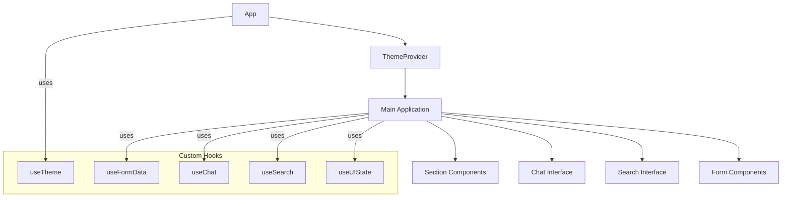
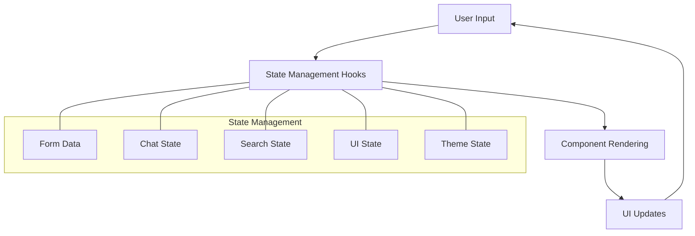
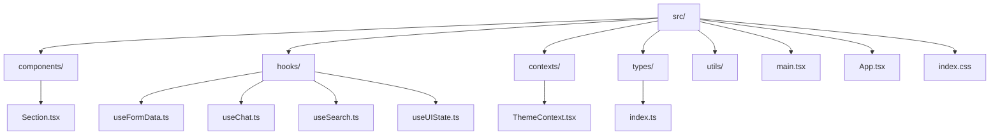
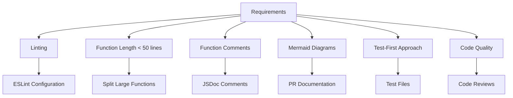

# Code Structure Documentation

## Component Structure

```mermaid
graph TD
    A[App] --> B[ThemeProvider]
    B --> C[Main Application]
    C --> D[Section Components]
    C --> E[Chat Interface]
    C --> F[Search Interface]
    C --> G[Form Components]
    
    subgraph "Custom Hooks"
        H[useTheme]
        I[useFormData]
        J[useChat]
        K[useSearch]
        L[useUIState]
    end
    
    A -- uses --> H
    C -- uses --> I
    C -- uses --> J
    C -- uses --> K
    C -- uses --> L
```

## Data Flow

```mermaid
flowchart TD
    A[User Input] --> B[State Management Hooks]
    B --> C[Component Rendering]
    C --> D[UI Updates]
    D --> A
    
    subgraph "State Management"
        B1[Form Data]
        B2[Chat State]
        B3[Search State]
        B4[UI State]
        B5[Theme State]
    end
    
    B --- B1
    B --- B2
    B --- B3
    B --- B4
    B --- B5
```

## File Structure

```mermaid
graph TD
    A[src/] --> B[components/]
    A --> C[hooks/]
    A --> D[contexts/]
    A --> E[types/]
    A --> F[utils/]
    A --> G[main.tsx]
    A --> H[App.tsx]
    A --> I[index.css]
    
    B --> B1[Section.tsx]
    
    C --> C1[useFormData.ts]
    C --> C2[useChat.ts]
    C --> C3[useSearch.ts]
    C --> C4[useUIState.ts]
    
    D --> D1[ThemeContext.tsx]
    
    E --> E1[index.ts]
```

## Requirements Implementation

```mermaid
graph TD
    A[Requirements] --> B[Linting]
    A --> C[Function Length < 50 lines]
    A --> D[Function Comments]
    A --> E[Mermaid Diagrams]
    A --> F[Test-First Approach]
    A --> G[Code Quality]
    
    B --> B1[ESLint Configuration]
    C --> C1[Split Large Functions]
    D --> D1[JSDoc Comments]
    E --> E1[PR Documentation]
    F --> F1[Test Files]
    G --> G1[Code Reviews]
``` 