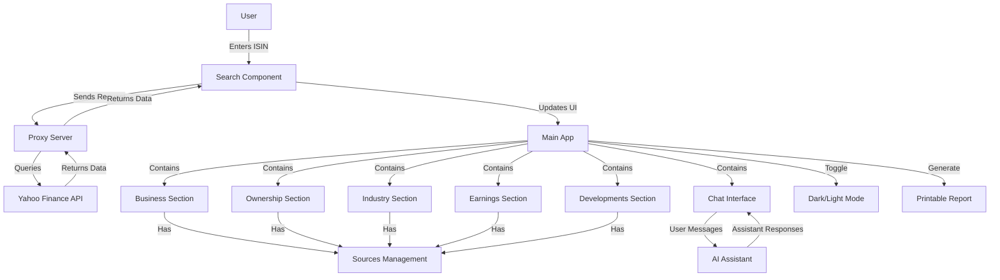

# Application Flow Diagram

This diagram illustrates the main flow and components of the Corporate Analyst Tool.

## Component Relationships

- **Search Component**: Handles ISIN lookup via the proxy server
- **Proxy Server**: Prevents CORS issues when accessing Yahoo Finance API
- **Main App**: Contains all sections and manages global state
- **Section Components**: Business, Ownership, Industry, Earnings, Developments
- **Sources Management**: Allows adding/removing reference URLs for each section
- **Chat Interface**: Enables communication with AI assistant
- **Dark/Light Mode**: Toggles between dark and light themes
- **Printable Report**: Generates a formatted report of all analysis data 